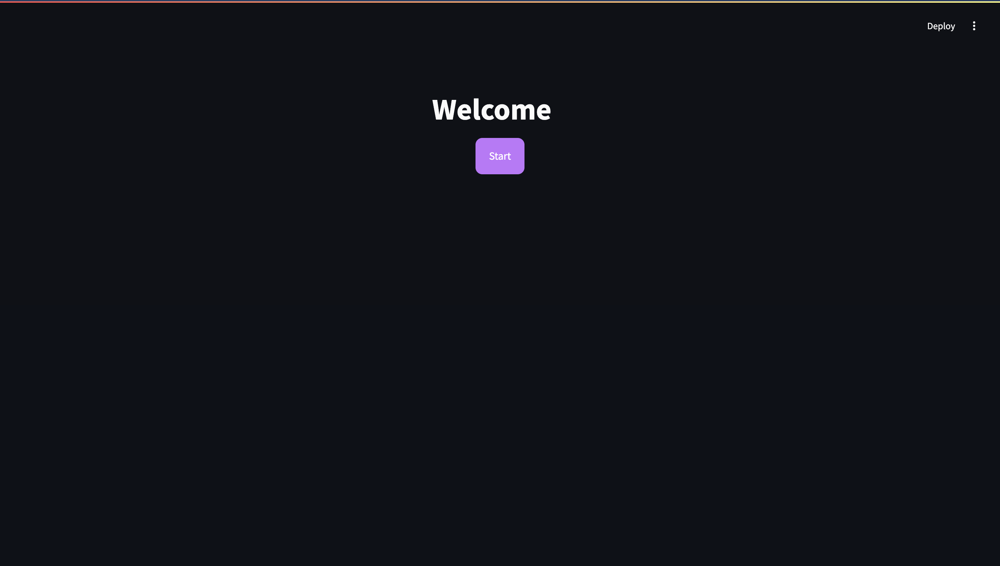
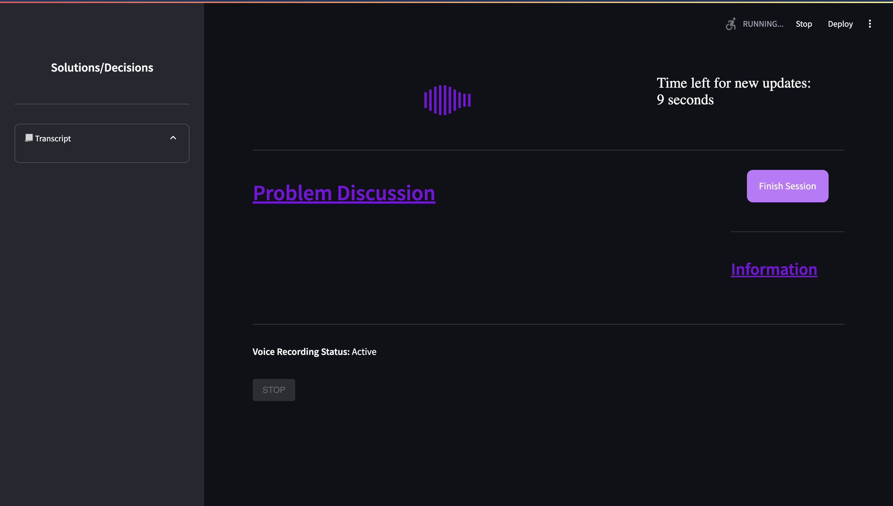
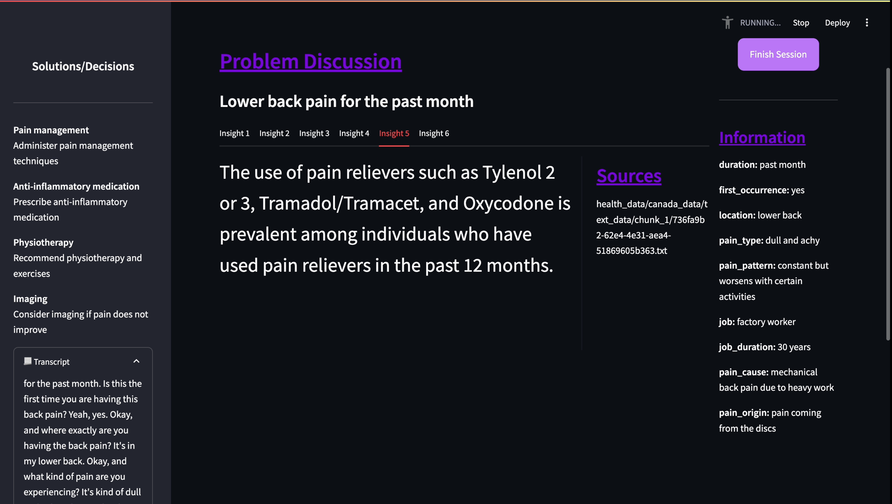

# AInsight: Augmenting Expert Decisions with On-the-Fly Insights Grounded in Historical Data

## About the Project

This is the codebase for the paper named "AInsight: Augmenting Expert Decisions with On-the-Fly Insights Grounded in Historical Data". Author names will be published upon acceptance of the work.

This Streamlit-based prototype aims to help doctors make more informed decisions by generating on-the-fly insights grounded in historical data while having conversations with patients. The system can detect key information from patient conversations, including:
- The patient's medical problems
- Additional contextual information
- Solutions proposed by the doctor

## Data Sources

The sample data is collected from Open Government Canada. The system uses embeddings stored in a ChromaDB database. A sample database is provided, but it can be augmented by running the preprocessing file.

## Technical Architecture

The backend uses a pipeline built with LangChain that integrates several Azure AI services:
- Speech-to-Text for transcribing conversations
- Embedding models for semantic understanding
- Chat completion models for generating insights

### Requirements

To run this code, you need an Azure account with the following models deployed:
1. Speech-to-Text (STT)
2. Embedding model
3. Chat completion model

## Setup

1. Create a virtual environment:
```bash
python -m venv venv
source venv/bin/activate  # On Windows: venv\Scripts\activate
```

2. Install dependencies:
```bash
pip install -r requirements.txt
```

3. Set up environment variables:
```bash
cp .env.example .env
# Edit .env with your Azure configuration
```

Required environment variables include:
- Azure OpenAI endpoints and API keys
- Azure Speech-to-Text configuration
- Azure Chat Completion model settings

## Running the Application

### 1. Preprocessing Data (Optional)

To augment the sample embedding database with additional data:

```bash
python preprocess.py
```

This will process text and CSV files from the sample_data directory and add them to the embedding database.

### 2. Running the User Interface

Start the Streamlit application:

```bash
streamlit run run.py
```

## Application Workflow

1. **Start Screen**: The application begins with a welcome screen where users can start a new session.

   

2. **Interaction Screen**: During the session, the application:
   - Listens to the doctor-patient conversation
   - Transcribes the audio in real-time
   - Identifies medical problems and relevant context
   - Generates insights based on historical data
   - Captures solutions proposed by the doctor

   
   *The interactive screen while listening to the conversation*

3. **Complete Conversation**: As the conversation evolves, different parts of the UI are populated with detected information and insights.

   
   *The interactive screen after conversation analysis is complete*

## Project Structure

- **agent/**: Contains the LangChain pipeline and conversation processing logic
- **view/**: UI components and Streamlit interface code
- **sample_data/**: Example medical data for testing
- **sample_embedding_db/**: Pre-built database of embeddings
- **preprocess.py**: Script for processing additional data into embeddings
- **run.py**: Main application entry point

## API Documentation

When running locally, the application is accessible at:
- http://localhost:8501
